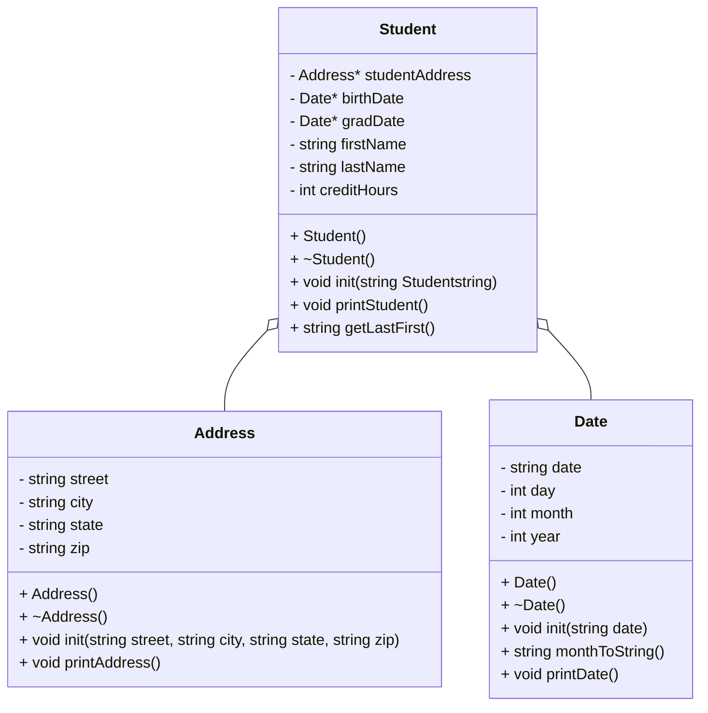

# Algorithm for Heap of Students program
## Mermaid diagram

## Algorithm for Address
### Header
1. protected:
    1. string street
    1. string city
    1. string state
    1. string zip
1. public:
    1. no-argument Address constructor
    1. Address deconstructor
    1. void init(string street, string city, string state, string zip)
    1. void printAddress()
### Implementation
1. Address constructor
    1. street = "";
    1. city = "";
    1. state = "";
    1. zip = "";
1. Address deconstructor
1. void init(string street, string city, string state, string zip)
    1. Address::street = street;
    1. Address::city = city;
    1. Address::state = state;
    1. Address::zip = zip;
1. void printAddress()
    1. print(street + \n + city + state + ", " + zip + \n);
## Algorithm for Date
### Header
1. protected:
    1. string date
    1. int day
    1. int month
    1. int year
1. public:
    1. no-argument Date constructor
    1. Date deconstructor
    1. void init(string date)
    1. string monthToString()
    1. void printDate()
## Implementation
1. Date constructor
    1. date = "";
    1. day = 0;
    1. month = 0;
    1. year = 0;
1. Date deconstructor
1. void init(string date)
    1. Date::date = date;
    1. put date into stringstream
    1. get first value (with "/" seperating value) and put it into month
    1. get next value and put it into day
    1. get last value and put it into year
1. string monthToString()
    1. string stringMonth = "";
    1. if (month = 1)
        1. stringMonth = "January";
    1. else if (month = 2)
        1. stringMonth = "February";
    1. else if (month = 3)
        1. stringMonth = "March";
    1. else if (month = 4)
        1. stringMonth = "April";
    1. else if (month = 5)
        1. stringMonth = "May";
    1. else if (month = 6)
        1. stringMonth = "June";
    1. else if (month = 7)
        1. stringMonth = "July";
    1. else if (month = 8)
        1. stringMonth = "August";
    1. else if (month = 9)
        1. stringMonth = "September";
    1. else if (month = 10)
        1. stringMonth = "October";
    1. else if (month = 11)
        1. stringMonth = "November";
    1. else
        1. stringMonth = "December";
    1. end if
    1. return stringMonth;
1. void printDate()
    1. print(monthToString() + day + ", " + year + \n);
## Algorithm for Student
### Header
1. protected:
    1. Address* studentAddress;
    1. Date* birthDate;
    1. Date* gradDate;
    1. string firstName;
    1. string lastName;
    1. int creditHours;
1. public:
    1. no-argument Student constructor
    1. Student deconstructor
    1. void init(string studentString)
    1. void printStudent();
    1. string getLastFirst();
### Implementation
1. Student constructor
    1. studentAddress = new Address();
    1. birthDate = new Date();
    1. gradDate = new Date();
    1. firstName = "";
    1. lastName = "";
    1. creditHours = 0;
1. Student deconstructor
    1. delete studentAddress;
    1. delete birthDate;
    1. delete gradDate;
1. void init(string studentString)
1. void printStudent()
1. string getLastFirst()

